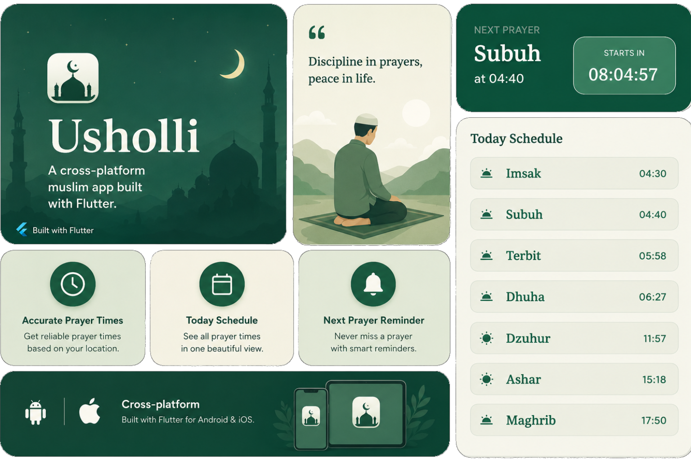
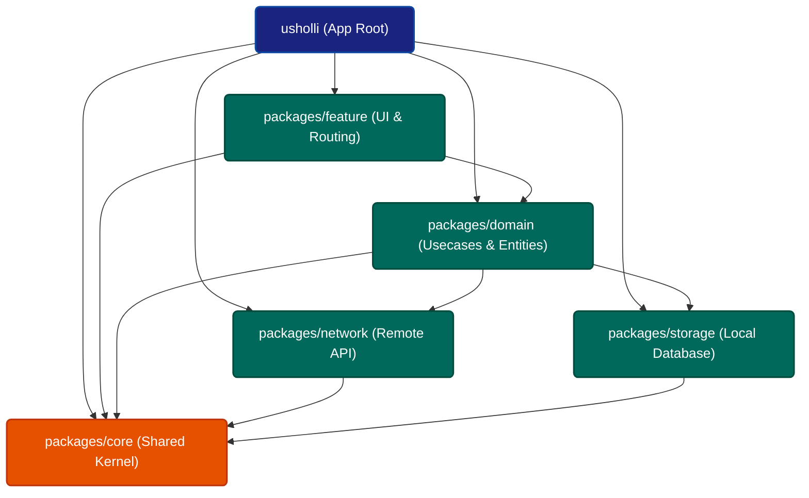

<div align="center">
    <h1>Usholli</h1>
    <p>A cross-platform Muslim app built with Flutter.</p>
</div>

---

<p align="center">
  
</p>

## Architecture & Project Structure

Usholli is built using a highly modular multi-package architecture (monorepo managed by [Melos](https://melos.invertase.dev/)). The codebase is divided into layer-focused modules to maintain clean separation of concerns, scalability, and independent testing.

### Module Dependency Diagram

The diagram below shows how the application and its child packages relate to each other:



### Module Roles
* [**`usholli (App Root)`**](/README.md): The main application entrypoint. Boots up dependencies and runs the main app.
* [**`packages/feature`**](/packages/feature/README.md): Presentation/UI layer. Houses all screens, BLoCs, custom pages, and routing configurations using `go_router`.
* [**`packages/domain`**](/packages/domain/README.md): Business Logic & Usecases. Holds repository interfaces, entities/models, and use cases according to Clean Architecture.
* [**`packages/network`**](/packages/network/README.md): Remote Data Source. Interfaces with external HTTP endpoints (e.g., Muslim API) using Retrofit and Dio.
* [**`packages/storage`**](/packages/storage/README.md): Local Storage. Handles SQLite database interactions using Drift and key-value preference storage via Shared Preferences.
* [**`packages/core`**](/packages/core/README.md): Common Shared Layer. Exports shared packages, manages configurations (via Envied), handles global themes, base classes, custom exceptions, and utilities.

---

## Features

- Today's Prayer Time schedules.
- Next prayer countdown.
- City-based local query searches.
- Offline support and caching capabilities.

## Tech Stack & Core Libraries

* **State Management**: [BLoC](https://pub.dev/packages/bloc)
* **Dependency Injection**: [Injectable](https://pub.dev/packages/injectable) & [Get It](https://pub.dev/packages/get_it)
* **Local Database**: [Drift](https://pub.dev/packages/drift) (SQLite) & [Shared Preferences](https://pub.dev/packages/shared_preferences)
* **Networking**: [Dio](https://pub.dev/packages/dio) & [Retrofit](https://pub.dev/packages/retrofit)
* **Routing**: [Go Router](https://pub.dev/packages/go_router)
* **Serialization**: [Dart Mappable](https://pub.dev/packages/dart_mappable)
* **Monorepo Tooling**: [Melos](https://pub.dev/packages/melos)

---

## Data Source

Usholli App uses many various API:
* [API Muslim](https://api.myquran.com/)

---

## How to Run

1. **Clone the repository**:
   ```bash
   git clone https://github.com/Mufiidz/usholli.git
   cd usholli
   ```

2. **Copy environment variables file**:
   ```bash
   cp .env.example .env
   ```
   *Edit `.env` to configure your required settings.*

3. **Install Melos & bootstrap packages**:
   ```bash
   dart run melos bootstrap
   ```

4. **Generate files**:
   Generate version info:
   ```bash
   dart run tool/generate_version.dart
   ```
   Generate all `build_runner` code across all packages:
   ```bash
   dart run melos generate
   ```

5. **Run the app**:
   ```bash
   flutter run
   ```

---

## Lessons Learned

Throughout building this app, I explored and learned:

- Built app with modular package using melos.

---